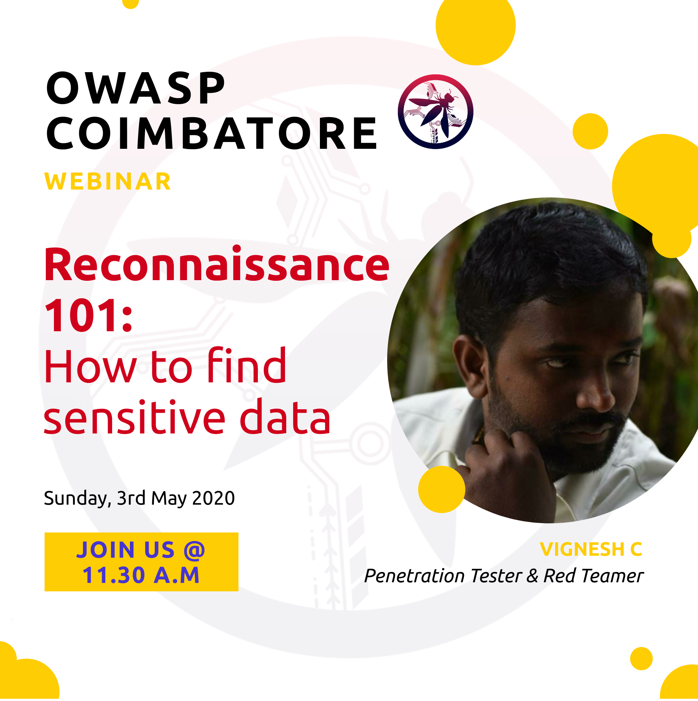

## Welcome

OWASP Coimbatore was founded in Jan, 2017. For the past 3 years, the Coimbatore Chapter has conducted numerous Meetups, Webinars and Conferences. All these confereneces are open meets where everyone can join and share their knowledge in Application Security. The chapter presents opportunities to the software community in contributing to secure application development.

OWASP provides speakers to Institution of Engineers for Wednesday technical talks related to application security they organize. OWASP also provides speakers to Computer Society of India for technical sessions related to application security they organize.

## Participation
The Open Web Application Security Project (OWASP) is a nonprofit foundation that works to improve the security of software. All of our projects ,tools, documents, forums, and chapters are free and open to anyone interested in improving application security. 

Chapters are led by local leaders in accordance with the [Chapter Leader Handbook](/www-policy/rules-of-procedure/chapter-handbook). Financial contributions should only be made online using the authorized online donation button. To be a SPEAKER at ANY OWASP Chapter in the world simply review the [speaker agreement](/www-policy/speaker-agreement) and then contact the local chapter leader with details of what OWASP Project, independent research, or related software security topic you would like to present.

Everyone is welcome and encouraged to participate in our [Projects](https://owasp.org/projects/), [Local Chapters](/chapters), [Events](https://owasp.org/events/), [Online Groups](https://groups.google.com/a/owasp.com/), and [Community Slack Channel](https://join.slack.com/t/owaspcoimbatore/shared_invite/zt-dzjz7u5t-4Nab~nJKCn7cHkTKY_wu7A). We especially encourage diversity in all our initiatives. OWASP is a fantastic place to learn about application security, to network, and even to build your reputation as an expert. We also encourage you to be [become a member](https://owasp.org/membership/) or consider a [donation](https://owasp.org/donate/?reponame=www-chapter-coimbatore&title=OWASP+Coimbatore) to support our ongoing work.

## Speakers

Would you like to speak on the upcoming OWASP Coimbatore Webinar? [Contact Us](mailto:adithyanak@owasp.org)

**Email Format :**

- Speaker name
- Job Role
- Company / Organization
- Country
- Email ID
- Contact Number
- Speaker Profile
- Presentation Details
    - Name / Title of the Presentation
    - Abstract of the presentation
    - Presentation time required
    
## Upcoming Events

## Local News
- OWASP Coimbatore Webinar in Partnership with We Are Plymouths on **Exploit Development - Stack Based Buffer Overflows** has been successfully completed.
- Click [here](https://www.youtube.com/watch?v=R9u1D3izvGs) to watch the recording of the Webinar.
- Everyone is welcome to join us at our chapter meetings.
- Stay tuned with the Chapter wiki & social media handles to get updates on upcomming webinars and meetings.

## Tweets

    
<blockquote class="twitter-tweet">
Here are the slides of the <a href="https://twitter.com/hashtag/OWASP_Coimbatore?src=hash&amp;ref_src=twsrc%5Etfw">#OWASP_Coimbatore</a>&#39;s webinar on <a href="https://twitter.com/hashtag/Reconnaissance?src=hash&amp;ref_src=twsrc%5Etfw">#Reconnaissance</a> by Mr. vignesh Chandrasekaran (<a href="https://twitter.com/bbinfosec?ref_src=twsrc%5Etfw">@bbinfosec</a>) Chief Security Officer at Precise Thinking TCT.<a href="https://twitter.com/owasp?ref_src=twsrc%5Etfw">@owasp</a> <a href="https://twitter.com/OWASPBangalore?ref_src=twsrc%5Etfw">@OWASPBangalore</a> <a href="https://twitter.com/OWASPLondon?ref_src=twsrc%5Etfw">@OWASPLondon</a> <a href="https://twitter.com/OWASPdelhi?ref_src=twsrc%5Etfw">@OWASPdelhi</a> <a href="https://t.co/bhN59aj0Lo">https://t.co/bhN59aj0Lo</a>
&mdash; OWASP Coimbatore (@OwaspCBE) <a href="https://twitter.com/OwaspCBE/status/1257523703857831937?ref_src=twsrc%5Etfw">May 5, 2020</a></blockquote> 

