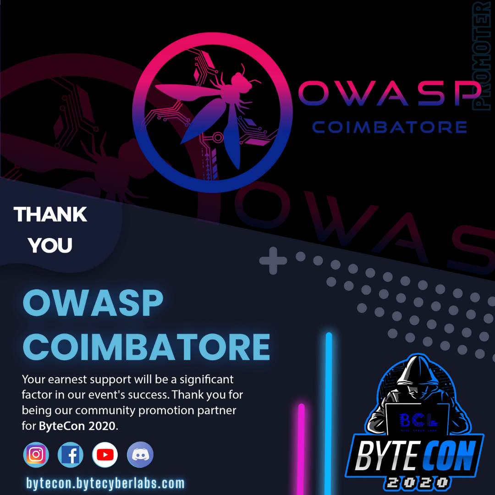

## Past Events

**21 October 2021, 3:00 PM - 4:20PM**

Hosted a webinar on **Open Source Intelligence**


<hr>

**27 September 2020, 11:30 AM - 1:00PM**

**OWASP Tiruvallur** in collaboration with **OWASP Coimbatore** conduced a free cyber meetup.Adithyan AK from OWASP Coimbatore delivered a session on Open Source Intelligence.


<hr>

**21-25 September 2020**

**OWASP Coimbatore** joined hands with [Bytecyberlabs](http://bytecon.bytecyberlabs.com) as an promotional partner for the most exciting event - ByteCon 2020. 





<hr>

**Day 1**
https://www.youtube.com/watch?v=lgQW9Ug_AvU

<hr>

**Day 2**
https://www.youtube.com/watch?v=V8Hvj0-6xpM

<hr>


**3rd May, 2020 11.30 A.M**


**Platform**

Google Meets

**Slides**

[Let's Recon by Mr. Vignesh C](https://github.com/OWASP/www-chapter-coimbatore/blob/master/assets/files/Lets%20Recon.pdf)
<hr>

**23rd April, 2020 6-8 PM**

OWASP Coimbatore in Collaboration with We Are Plymouths `Exploit Development - Stack Based Buffer Overflows` Webinar.

<a href="https://twitter.com/weareplymouths/status/1255146018821206018"></a>

[Watch Recording](https://www.youtube.com/watch?v=R9u1D3izvGs)

**Platform**

Zoom
<hr>

**2nd February, 2020 6-8 PM**

OWASP Coimbatore Python - Security Essentials Webinar

**Platform**

Zoom
<hr>

**13th December, 2019 7 - 9 PM**

OWASP Coimbatore Bug Bounty Webinar

**Platform**

Google Hangouts Meet
<hr>

**29th September, 2019 7.30 - 8.30 PM**

OWASP Coimbatore Ethical Hacking Hands-On Webinar in **Tamil** ([Download Recording](https://drive.google.com/file/d/1gaErUWur_sIH4lDvhcezC3ycX76J6A_M/view?usp=drivesdk))

**Platform**

GoTo Meeting
<hr>

**21st June, 2019 6-8 PM**

OWASP Coimbatore Application Security Online Workshop

**Platform**

GoTo Meeting
<hr>

**16th April, 2019 2:30 PM**

OWASP Coimbatore Monthly Chapter Meetup

**Venue**

Sri Krishna College of Engineering and Technology, Bkpudur, Coimbatore - 641008 
<hr>

**12th March, 2019 6.00 PM**

OWASP Coimbatore Monthly Chapter Meetup

**Venue**

Sri Krishna College of Engineering and Technology, Bkpudur, Coimbatore - 641008 
<hr>

**3rd February, 2019**

OWASP Coimbatore Monthly Chapter Meetup

**Agenda**
```
 - 09:30a.m – 10.00a.m => Meetup starts
 - 10:00a.m – 11.00a.m => How Do I Pwn You - Vignesh C, KGISL
 - 11.00a.m - 11.15a.m => Break
 - 11:15a.m – 11.45a.m => Breaking Fingerprint Authentication 2 - Mesanch M, StrongBox IT Pvt Ltd.
 - 11:45a.m – 12:30p.m => Cracking OSCP : Try Harder - Sanoj, StrongBox IT Pvt Ltd.
 - 12:30p.m – 12:45p.m => Meetup ends
```
**Venue**

Sri Krishna College of Engineering and Technology, Bkpudur, Coimbatore - 641008 
<hr>

**6th January, 2019**

OWASP Coimbatore Monthly Chapter Meetup

**Agenda**
 ```
 - 09:30a.m – 10.00a.m => Meetup starts
 - 10:00a.m – 11.00a.m => Networking Fundamentals in Cyber Security - Vignesh C, KGISL
 - 11.00a.m - 11.15a.m => Break
 - 11:15a.m – 11.45a.m => OWASP Top 10 2018 Testing Guide - Adithyan AK, OWASP Coimbatore
 - 11:45a.m – 12:30p.m => Breaking Fingerprint Authentication 1 - Mesanch M, StrongBox IT Pvt Ltd.
 - 12:30p.m – 12:45p.m => Meetup ends
```
**Venue**

Sri Krishna College of Engineering and Technology, Bkpudur, Coimbatore - 641008 
<hr>

**11th November 2018**

OWASP Coimbatore Monthly Chapter Meetup

**Agenda**
```
 - 09:30a.m – 10.00a.m => Workshop Inauguration
 - 10:00a.m – 11.00a.m => Getting started with Bug Bounty - Guhan Raja, Priyadharshini Engineering college
 - 11.00a.m - 11.30a.m => Break
 - 11:30a.m – 12.30p.m => Buffer Overflows and Exploit Development- Mohan Ravinchandran
 - 11:45a.m – 12:30p.m => Breaking Fingerprint Authentication 1 - Mesanch M, StrongBox IT Pvt Ltd.
 - 12:30p.m – 12:45p.m => Ending cermony
```
**Venue**

Sri Krishna College of Engineering and Technology, Bkpudur, Coimbatore - 641008 
<hr>

**9th September 2018**

OWASP Coimbatore Monthly Chapter Meetup

**Agenda**
```
 - 09:30a.m – 10.00a.m => Meetup starts
 - 10:00a.m – 11.00a.m => OWASP IOT Top 10 - Adithyan AK, OWASP Coimbatore
 - 11.00a.m - 11.15a.m => Break
 - 11:15a.m – 11.45a.m => Session Hijacking with Advanced Cross Site Scripting attacks - Guhan Raja
 - 11:45a.m – 12:30p.m => Why Networking is essential for Cyber Security Beginners - Vignesh C, KGISL
 - 12:30p.m – 12:45p.m => Meetup ends
```
**Venue**

Sri Krishna College of Engineering and Technology, Bkpudur, Coimbatore - 641008 
<hr>
