<h2>Past Events</h2>

  
  
27 September 2025 - Online Workshop (September 2025)

  

     
    

      
    
 
     
    <strong>Speaker:</strong> Speaker:</strong> Mr. Muthuvaradharajan D | Senior Cyber Security Consultant LTI MindTree
     
    <strong>Date:</strong> Saturday, September 27, 2025
     
    <strong>Time:</strong> 6:00 PM - 7:30 PM (IST)
     
    <strong>Venue:</strong> Online|Zoom
  

  
30 August 2025 - OWASP Coimbatore Chapter Meetup

   

  <!-- Registration Button -->
  <!-- <a href="https://your-registration-link.com" target="_blank" style="display: inline-block; background-color: #ff5722; color: white; padding: 10px 20px; text-decoration: none; border-radius: 5px; font-weight: bold; margin: 10px 0;">
    🔗 Registration Closed
  </a>
     -->

  

     
    
    
    
    
    
  

   
  <strong>Date:</strong> Saturday, August 30, 2025
   
  <strong>Time:</strong> 9:00 AM – 4:00 PM (IST)
   
  <strong>Location:</strong> KPR INSTITUTE OF ENGINEERING AND TECHNOLOGY, AVINASHI ROAD, ARASUR, COIMBATORE. (https://share.google/qeCaZVSV5waY6UcYe)
    

  <strong>Agenda</strong>
  <table style="width:100%; border-collapse: collapse; margin-top: 10px;">
    <thead style="background-color: #f2f2f2;">
      <tr>
        <th style="border: 1px solid #ddd; padding: 8px;">Time</th>
        <th style="border: 1px solid #ddd; padding: 8px;">Speaker</th>
        <th style="border: 1px solid #ddd; padding: 8px;">Topic</th>
      </tr>
    </thead>
    <tbody>
      <tr>
        <td style="border: 1px solid #ddd; padding: 8px;">9:45 AM - 10:00 AM</td>
        <td style="border: 1px solid #ddd; padding: 8px;"></td>
        <td style="border: 1px solid #ddd; padding: 8px;">Introduction and Welcome Note</td>
      </tr>
      <tr>
        <td style="border: 1px solid #ddd; padding: 8px;">10:00 AM - 10:45 AM</td>
        <td style="border: 1px solid #ddd; padding: 8px;">Ashok Kumar</td>
        <td style="border: 1px solid #ddd; padding: 8px;"><em>Your Photo My Intel: The Darker Side of Metadata Investigations</em></td>
      </tr>
      <tr>
        <td style="border: 1px solid #ddd; padding: 8px;">10:45 AM - 11:30 AM</td>
        <td style="border: 1px solid #ddd; padding: 8px;">Bashith Rahman</td>
        <td style="border: 1px solid #ddd; padding: 8px;">From Recon to Reporting: Breaking into Systems to Make Them Stronger</td>
      </tr>
      <tr>
        <td style="border: 1px solid #ddd; padding: 8px;">11:30 AM - 11:45 AM</td>
        <td style="border: 1px solid #ddd; padding: 8px;"></td>
        <td style="border: 1px solid #ddd; padding: 8px;">Break</td>
      </tr>
      <tr>
        <td style="border: 1px solid #ddd; padding: 8px;">11:45 AM - 12:30 PM</td>
        <td style="border: 1px solid #ddd; padding: 8px;">Thejeshwini</td>
        <td style="border: 1px solid #ddd; padding: 8px;"><em>Modeling Trust: Threat Modeling for AI</em></td>
      </tr>
      <tr>
        <td style="border: 1px solid #ddd; padding: 8px;">12:30 PM - 1:30 PM</td>
        <td style="border: 1px solid #ddd; padding: 8px;"></td>
        <td style="border: 1px solid #ddd; padding: 8px;">Lunch Break - <em>Bon Appétit!!!</em></td>
      </tr>
      <tr>
        <td style="border: 1px solid #ddd; padding: 8px;">1:45 PM - 2:30 PM</td>
        <td style="border: 1px solid #ddd; padding: 8px;">Shreyan</td>
        <td style="border: 1px solid #ddd; padding: 8px;"><em>Quantum Computing and The Future of Cybersecurity</em></td>
      </tr>
      <tr>
        <td style="border: 1px solid #ddd; padding: 8px;">2:30 PM - 2:45 PM</td>
        <td style="border: 1px solid #ddd; padding: 8px;">—</td>
        <td style="border: 1px solid #ddd; padding: 8px;">Break</td>
      </tr>
      <tr>
        <td style="border: 1px solid #ddd; padding: 8px;">2:45 PM - 3:30 PM</td>
        <td style="border: 1px solid #ddd; padding: 8px;"></td>
        <td style="border: 1px solid #ddd; padding: 8px;">Networking - <em>Engaging discussions and networking opportunities with industry experts!</em></td>
      </tr>
      <tr>
        <td style="border: 1px solid #ddd; padding: 8px;">4:00 PM - 4:30 PM</td>
        <td style="border: 1px solid #ddd; padding: 8px;"></td>
        <td style="border: 1px solid #ddd; padding: 8px;">Closing Note | Summary & Plan for Next Monthly Meet</td>
      </tr>
    </tbody>
  </table>

  
  
12 July 2025 - Online Workshop (July 2025)

  

    <strong>Online Meetup - July 2025</strong>
     
    

      
    
 
     
    <strong>Speaker:</strong> Ms. Vaishali Nagori | Senior Security Researcher @FEV India Pvt Ltd
     
    <strong>Date:</strong> Saturday, July 12, 2025
     
    <strong>Time:</strong> 6:00 PM - 7:30 PM (IST)
     
    <strong>Venue:</strong> Online|Zoom
  

  
10 May 2025 - Offline Meetup Event (May 2025)

  

    <strong>Offline Meetup - May 2025</strong>
     
    

      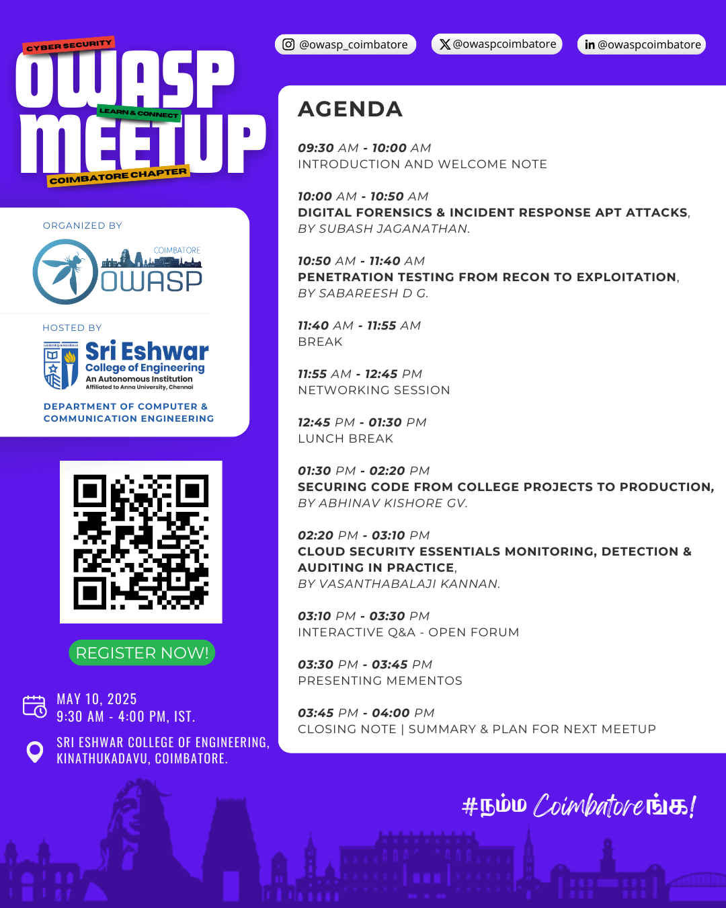
    
 
     
    <strong>Date:</strong> Saturday, May 10, 2025
     
    <strong>Time:</strong> 9:30 AM - 4:00 PM (IST)
     
    <strong>Venue:</strong> : Sri Eshwar College of Engineering, Kinathukadavu, Coimbatore - 641202
     
  

  
15 February 2025 - Monthly Workshop - From Code to Compliance (Devsecops)

  

    <strong>Monthly Workshop - From Code to Compliance (Devsecops)</strong>
     
    

      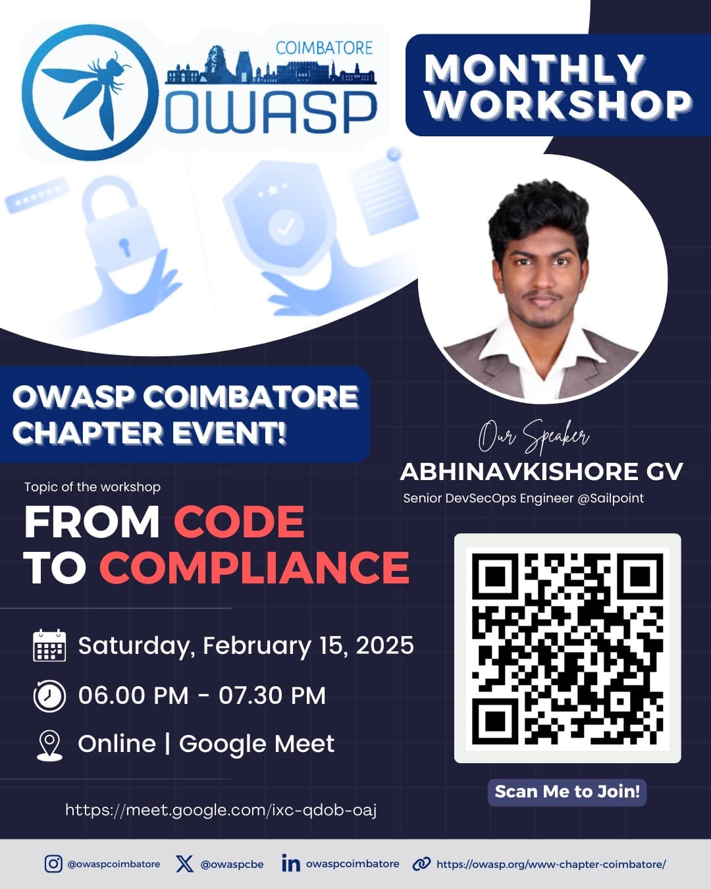
    

     
    <strong>Date:</strong> Saturday, February 15, 2025
     
    <strong>Time:</strong> 6:00 PM - 7:30 PM (IST)
     
    <strong>Venue:</strong> Online | Google Meet
     
    <strong>Speaker:</strong> Abhinav Kishore GV | Senior DevSecOPS Engineer @Sailpoint
     
  

  
25 January 2025 - Monthly Workshop - Web Attack - HTTP Smuggling Attacks

  

    <strong>Monthly Workshop - Web Attack - HTTP Smuggling Attacks</strong>
     
    

      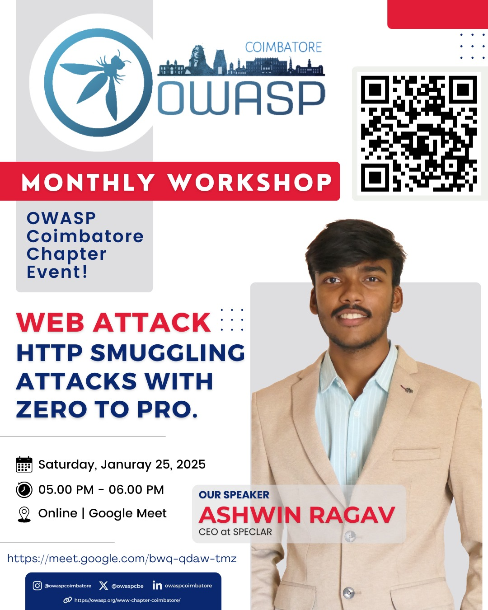
    

     
    <strong>Date:</strong> Saturday, January 25, 2025
     
    <strong>Time:</strong> 5:00 PM - 6:00 PM (IST)
     
    <strong>Venue:</strong> Online | Google Meet
     
    <strong>Speaker:</strong> Ashwin Ragav 
     
  

  
21 December 2024 - Offline Meetup Event

  

    <strong>Offline Meetup Event</strong>
     
    

      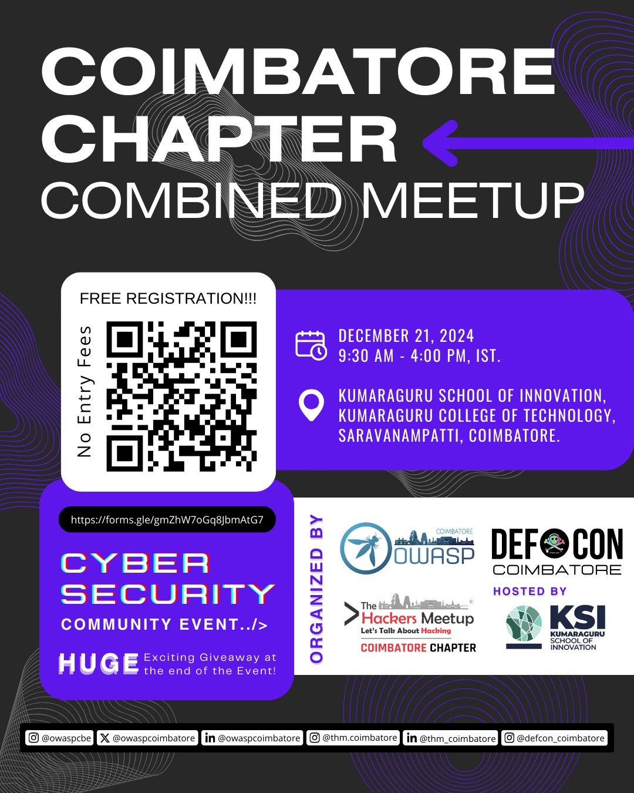
    

     
    <strong>Date:</strong> Sunday, December 21, 2024
     
    <strong>Time:</strong> 9:30 AM - 4:00 PM (IST)
     
    <strong>Venue:</strong> Kumaraguru School of Innovation, Kumaraguru College of Technology, Coimbatore.
     
  

  
30 November 2024 - Monthly Workshop - Intro to Red Teaming

  

    <strong>Monthly Workshop - Drone Forensics 101</strong>
     
    

      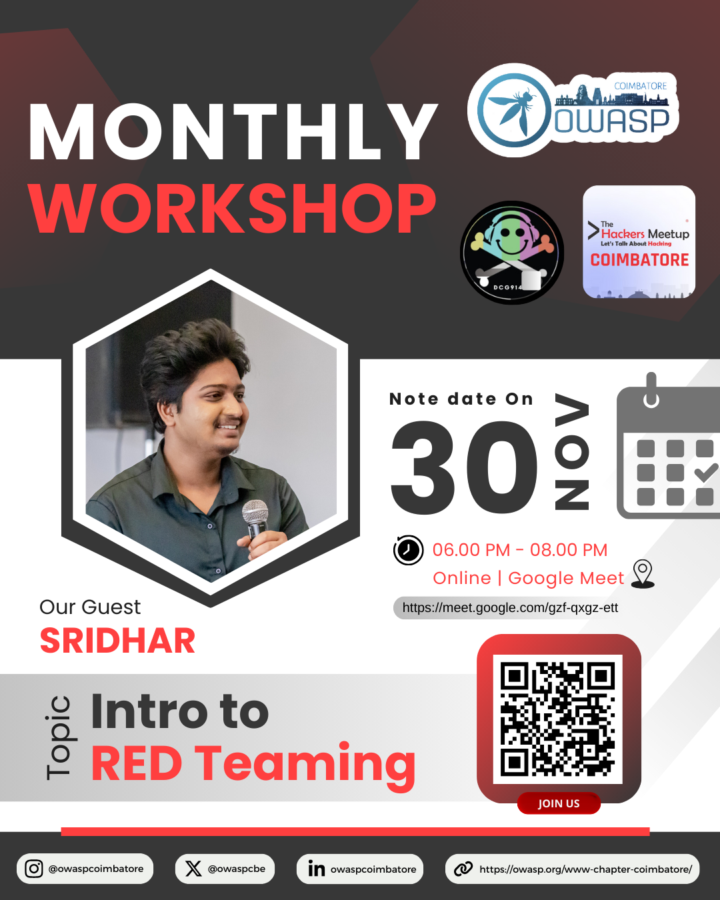
    

     
    <strong>Date:</strong> Saturday, November 30, 2024
     
    <strong>Time:</strong> 6:00 PM - 8:00 PM (IST)
     
    <strong>Venue:</strong> Online | Google Meet
     
    <strong>Speaker:</strong> Sridhar Cyber Security Consultant
     
  

  
26 October 2024 - Monthly Workshop - Mobile Pentesting

  

    <strong>Monthly Workshop - Drone Forensics 101</strong>
     
    

      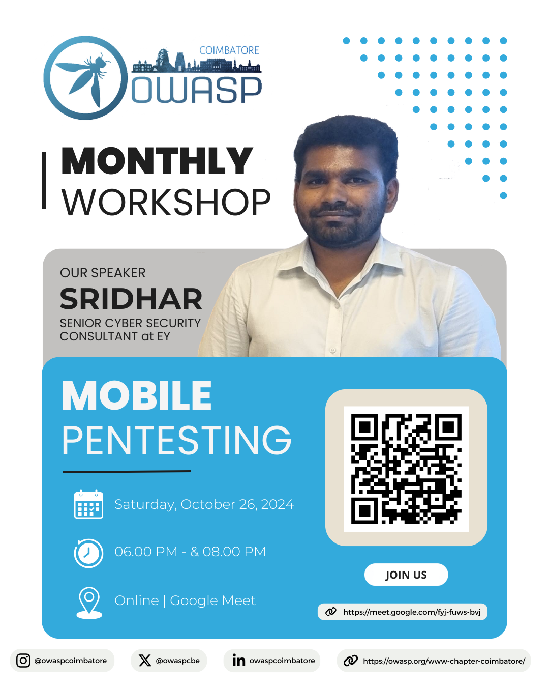
    

     
    <strong>Date:</strong> Saturday, October 26, 2024
     
    <strong>Time:</strong> 6:00 PM - 8:00 PM (IST)
     
    <strong>Venue:</strong> Online | Google Meet
     
    <strong>Speaker:</strong> Sridhar (Senior Cyber Security Consultant, EY)
     
  

  
19 October 2024 - Monthly Workshop - Drone Forensics 101

  

    <strong>Monthly Workshop - Drone Forensics 101</strong>
     
    

      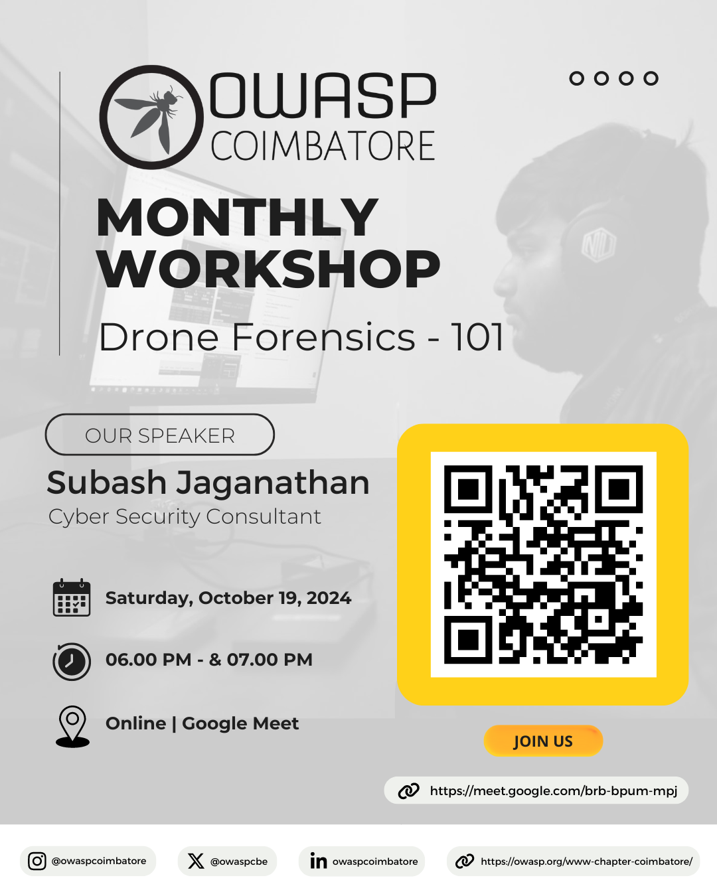
    

     
    <strong>Date:</strong> Saturday, October 19, 2024
     
    <strong>Time:</strong> 6:00 PM - 7:00 PM (IST)
     
    <strong>Venue:</strong> Online | Google Meet
     
    <strong>Speaker:</strong> Subash Jaganathan (Cyber Security Consultant)
     
  

  
14 September 2024 - Monthly Workshop - Understanding Cloud Security with GOAT Tools

  

    <strong>Monthly Workshop - Understanding Cloud Security with GOAT Tools</strong>
     
    

      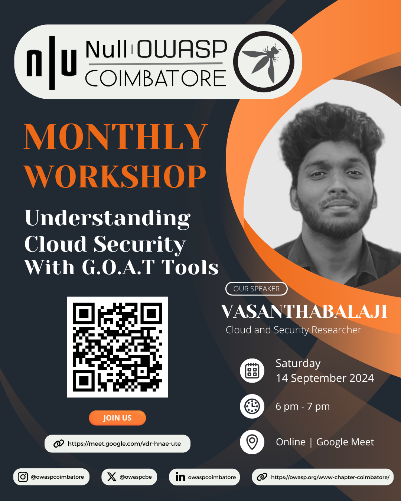
    

     
    <strong>Date:</strong> Saturday, September 14, 2024
     
    <strong>Time:</strong> 6:00 PM - 7:00 PM (IST)
     
    <strong>Venue:</strong> Online | Google Meet
     
    <strong>Speaker:</strong> Vasanthabalaji (Cloud and Security Researcher)
     
  

  
24 August 2024 - OWASP & Null Combined Coimbatore Chapter Meetup

  

    <strong>OWASP & Null Combined Coimbatore Chapter Meetup</strong>
     
    

      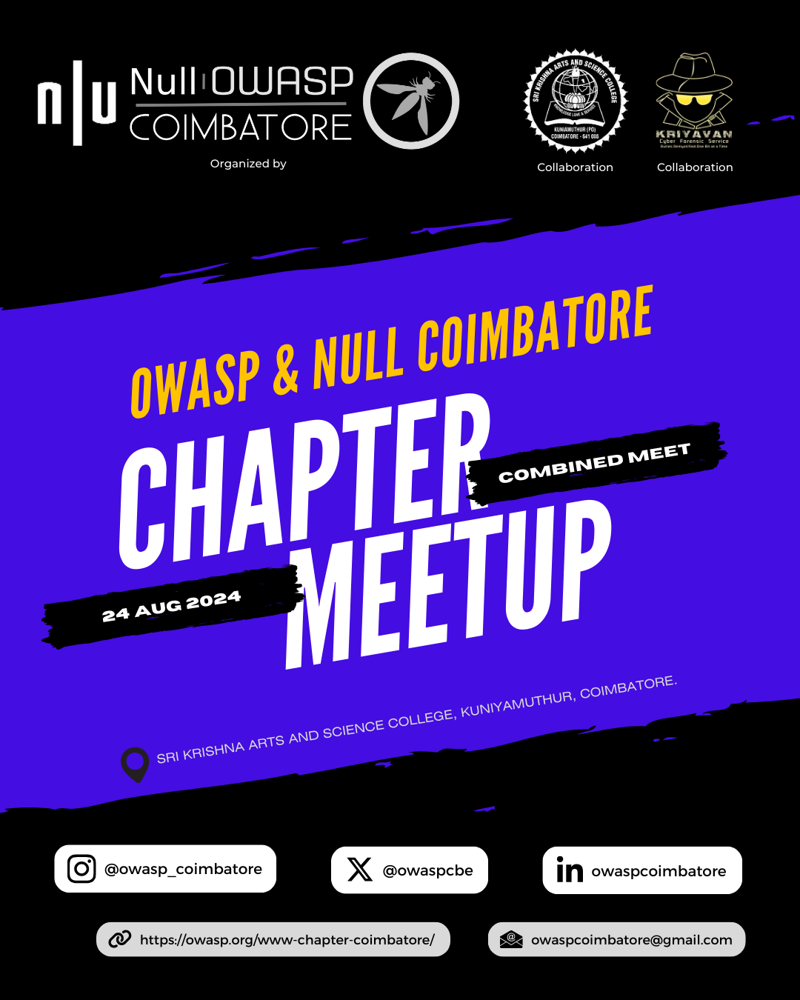
      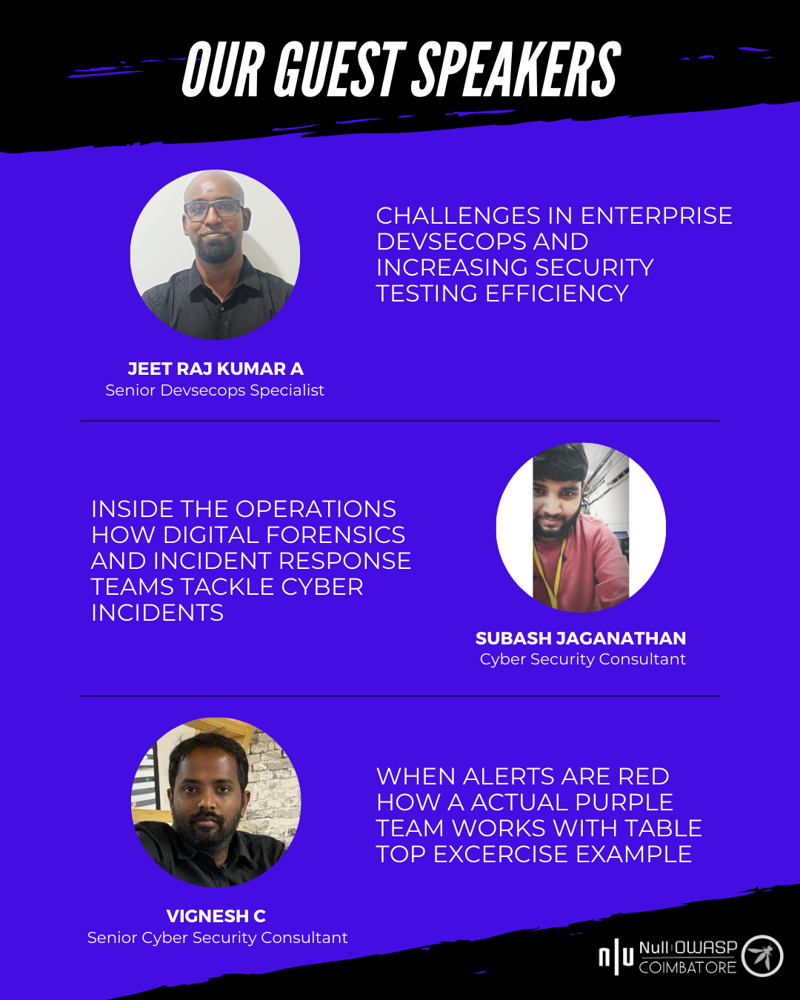
      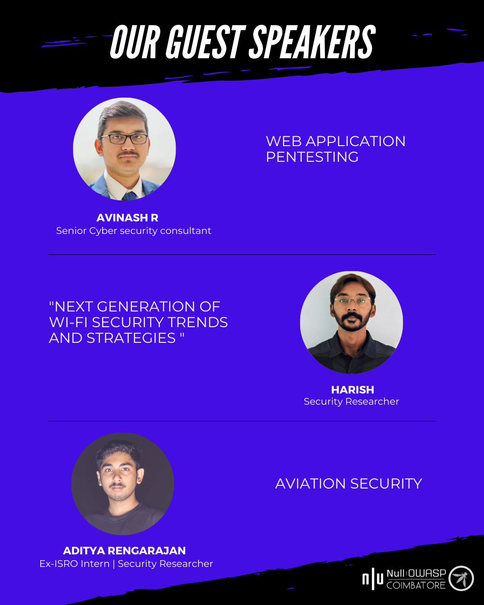
    

     
    <strong>Date:</strong> Saturday, August 24, 2024
     
    <strong>Time:</strong> 9:30 AM – 4:30 PM (IST)
     
    <strong>Location:</strong> Sri Krishna College of Arts and Science, Kuniyamuthur, Coimbatore - 641008
     
     
    <strong>Agenda</strong>
    <ul>
      <li>9:30 AM - 10:00 AM: Introduction and Welcome Note by Arun.S </li>
      <li>10:00 AM - 10:45 AM: Jeet Raj Kumar - <em>Challenges in Enterprise DevSecOps & Increasing Security Testing Efficiency</em></li>
      <li>10:45 AM - 11:30 AM: Subash Jaganathan - <em>Digital Forensics & Incident Response Operations</em></li>
      <li>11:30 AM - 12:15 PM: Vignesh Chandrasekaran - <em>Purple Team Tabletop Exercise</em></li>
      <li>12:15 PM - 12:45 PM: Networking Session - <em>Join us for engaging discussions and networking opportunities with industry experts!</em></li>
      <li>12:45 PM - 1:45 PM: Lunch Break - <em>Bon Appetit!!!</em></li>
      <li>1:45 PM - 2:30 PM: Avinash R - <em>Web Application Pentesting</em></li>
      <li>2:30 PM - 3:15 PM: Harish R - <em>Next-Gen Wi-Fi Security Trends</em></li>
      <li>3:15 PM - 4:00 PM: Aaditya Rengarajan - <em>Aviation Security</em></li>
      <li>4:00 PM - 4:30 PM: Closing Note & Plan for Next Monthly Meet</li>
    </ul>
  

  
6 July 2024 - OWASP Coimbatore Combined Monthly Meetup

  

    <strong>OWASP Coimbatore Combined Monthly Meetup</strong>
     
    

      
      
      
    

     
    <strong>Date:</strong> Saturday, July 6, 2024
     
    <strong>Time:</strong> 5:45 PM – 10:00 PM (IST)
     
    <strong>Location:</strong> Online via Google Meet
     
     
    <strong>Agenda</strong>
    <ul>
      <li>5:45 PM - 6:00 PM: Introduction and Welcome</li>
      <li>6:00 PM - 7:00 PM: Ashok Kumar Mohan - <em>Unveiling Hidden Connections: Metadata Association Models in Cyber Crime Investigations</em></li>
      <li>7:00 PM - 7:45 PM: B.N. Chandrapal - <em>"Well, it's just an AWS Account ID"</em></li>
      <li>7:45 PM - 8:30 PM: Manivannan Arumugam - <em>"The Anatomy of Malware Campaign"</em></li>
      <li>8:30 PM - 8:40 PM: Conclusion</li>
    </ul>
  

  
30 December 2022 - A webinar on Cyber Forensics

  

    <strong>A webinar on Cyber Forensics</strong>
     
    
  

  
9 April 2022 - A webinar on Introduction to Bug Bounty

  

    <strong>A webinar on Introduction to Bug Bounty</strong>
     
    
  

  
19 March 2022 - A webinar on Cyber Crime Investigation: Indian Scenario by Subash J.

  

    <strong>A webinar on Cyber Crime Investigation: Indian Scenario by Subash J.</strong>
     
    
  

  
21 October 2021 - 4:20 PM - Hosted a webinar on Open Source Intelligence (OSINT)

  

    <strong>Hosted a webinar on Open Source Intelligence (OSINT)</strong>
     
    
  

  
27 September 2020 - OWASP Tiruvallur in collaboration with OWASP Coimbatore conducted a free cyber meetup

  

    <strong>OWASP Tiruvallur in collaboration with OWASP Coimbatore conducted a free cyber meetup.</strong>
    Adithyan AK from OWASP Coimbatore delivered a session on Open Source Intelligence.
     
    
  

  
3rd May 2020 - Let's Recon by Mr. Vignesh C

  

    <strong>Let's Recon by Mr. Vignesh C</strong>
     
    
     
    <strong>Platform</strong> Google Meets
     
    <strong>Slides</strong> <a href="https://github.com/OWASP/www-chapter-coimbatore/blob/master/assets/files/Lets%20Recon.pdf">Let's Recon by Mr. Vignesh C</a>
  

  
2nd February 2020 - OWASP Coimbatore Python - Security Essentials Webinar

  

    <strong>OWASP Coimbatore Python - Security Essentials Webinar</strong>
     
    <strong>Platform</strong> Zoom
  

  
13th December 2019 - OWASP Coimbatore Bug Bounty Webinar

  

    <strong>OWASP Coimbatore Bug Bounty Webinar</strong>
     
    <strong>Platform</strong> Google Hangouts Meet
  

  
29th September 2019 - OWASP Coimbatore Ethical Hacking Hands-On Webinar in Tamil

  

    <strong>OWASP Coimbatore Ethical Hacking Hands-On Webinar in Tamil</strong>
     
    <strong>Platform</strong> GoTo Meeting
  

  
21st June 2019 - OWASP Coimbatore Application Security Online Workshop

  

    <strong>OWASP Coimbatore Application Security Online Workshop</strong>
     
    <strong>Platform</strong> GoTo Meeting
  

  
16th April 2019 - OWASP Coimbatore Monthly Chapter Meetup

  

    <strong>OWASP Coimbatore Monthly Chapter Meetup</strong>
     
    <strong>Venue</strong> Sri Krishna College of Engineering and Technology, Bkpudur, Coimbatore - 641008
  

  
12th March 2019 - OWASP Coimbatore Monthly Chapter Meetup

  

    <strong>OWASP Coimbatore Monthly Chapter Meetup</strong>
     
    <strong>Venue</strong> Sri Krishna College of Engineering and Technology, Bkpudur, Coimbatore - 641008
  

  
3rd February 2019 - OWASP Coimbatore Monthly Chapter Meetup

  

    <strong>OWASP Coimbatore Monthly Chapter Meetup</strong>
     
    <strong>Agenda</strong>
    <ul>
      <li>09:30 AM – 10:00 AM => Meetup starts</li>
      <li>10:00 AM – 11:00 AM => How Do I Pwn You - Vignesh C, KGISL</li>
      <li>11:00 AM - 11:15 AM => Break</li>
      <li>11:15 AM – 11:45 AM => Breaking Fingerprint Authentication 2 - Mesanch M, StrongBox IT Pvt Ltd.</li>
      <li>11:45 AM – 12:30 PM => Cracking OSCP: Try Harder - Sanoj, StrongBox IT Pvt Ltd.</li>
      <li>12:30 PM – 12:45 PM => Meetup ends</li>
    </ul>
    <strong>Venue</strong> Sri Krishna College of Engineering and Technology, Bkpudur, Coimbatore - 641008
  

  
6th January 2019 - OWASP Coimbatore Monthly Chapter Meetup

  

    <strong>OWASP Coimbatore Monthly Chapter Meetup</strong>
     
    <strong>Agenda</strong>
    <ul>
      <li>09:30 AM – 10:00 AM => Meetup starts</li>
      <li>10:00 AM – 11:00 AM => Networking Fundamentals in Cyber Security - Vignesh C, KGISL</li>
      <li>11:00 AM - 11:15 AM => Break</li>
      <li>11:15 AM – 11:45 AM => OWASP Top 10 2018 Testing Guide - Adithyan AK, OWASP Coimbatore</li>
      <li>11:45 AM – 12:30 PM => Breaking Fingerprint Authentication 1 - Mesanch M, StrongBox IT Pvt Ltd.</li>
      <li>12:30 PM – 12:45 PM => Meetup ends</li>
    </ul>
    <strong>Venue</strong> Sri Krishna College of Engineering and Technology, Bkpudur, Coimbatore - 641008
  

  
11th November 2018 - OWASP Coimbatore Monthly Chapter Meetup

  

    <strong>OWASP Coimbatore Monthly Chapter Meetup</strong>
     
    <strong>Agenda</strong>
    <ul>
      <li>09:30 AM – 10:00 AM => Workshop Inauguration</li>
      <li>10:00 AM – 11:00 AM => Getting started with Bug Bounty - Guhan Raja, Priyadharshini Engineering college</li>
      <li>11:00 AM - 11:30 AM => Break</li>
      <li>11:30 AM – 12:30 PM => Buffer Overflows and Exploit Development- Mohan Ravinchandran</li>
      <li>12:30 PM – 12:45 PM => Ending ceremony</li>
    </ul>
    <strong>Venue</strong> Sri Krishna College of Engineering and Technology, Bkpudur, Coimbatore - 641008.
  

  
9th September 2018 - OWASP Coimbatore Monthly Chapter Meetup

  

    <strong>OWASP Coimbatore Monthly Chapter Meetup</strong>
     
    <strong>Agenda</strong>
    <ul>
      <li>09:30 AM – 10:00 AM => Meetup starts</li>
      <li>10:00 AM – 11:00 AM => OWASP IOT Top 10 - Adithyan AK, OWASP Coimbatore</li>
      <li>11:00 AM - 11:15 AM => Break</li>
      <li>11:15 AM – 11:45 AM => Session Hijacking with Advanced Cross Site Scripting attacks - Guhan Raja</li>
      <li>11:45 AM – 12:30 PM => Why Networking is essential for Cyber Security Beginners - Vignesh C, KGISL</li>
      <li>12:30 PM – 12:45 PM => Meetup ends</li>
    </ul>
    <strong>Venue</strong> Sri Krishna College of Engineering and Technology, Bkpudur, Coimbatore - 641008
  

