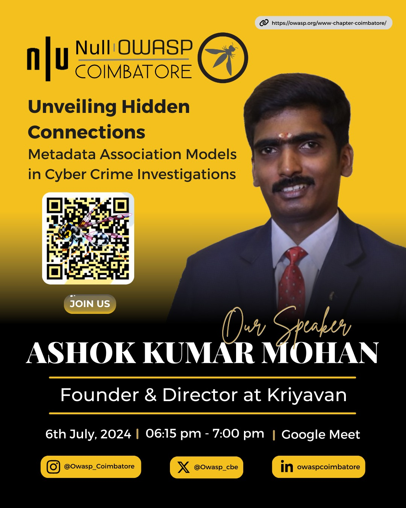
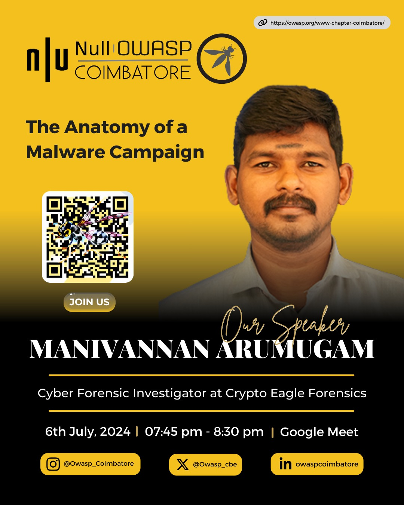
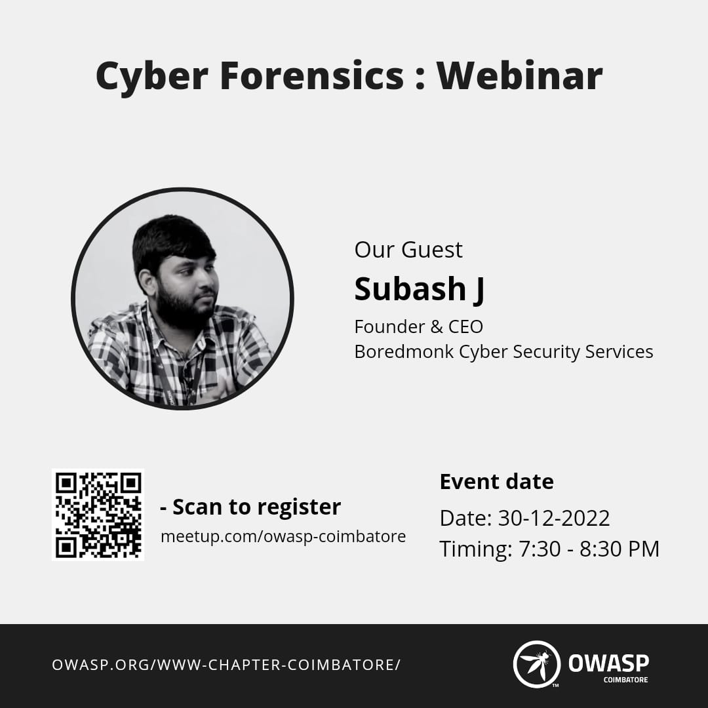
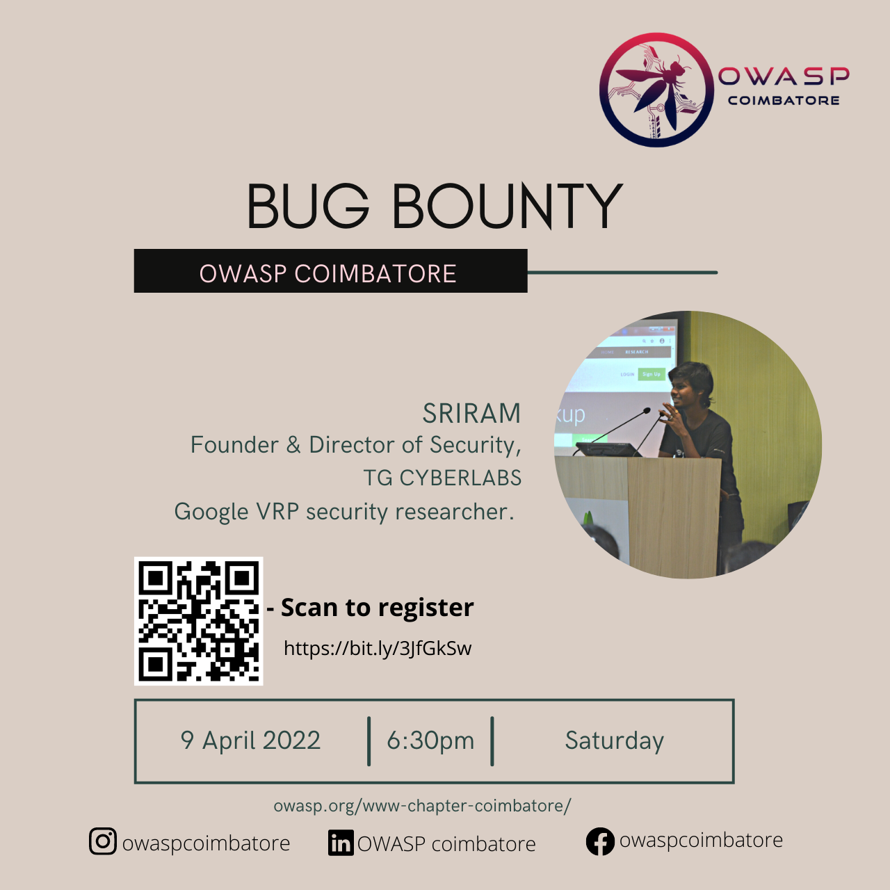
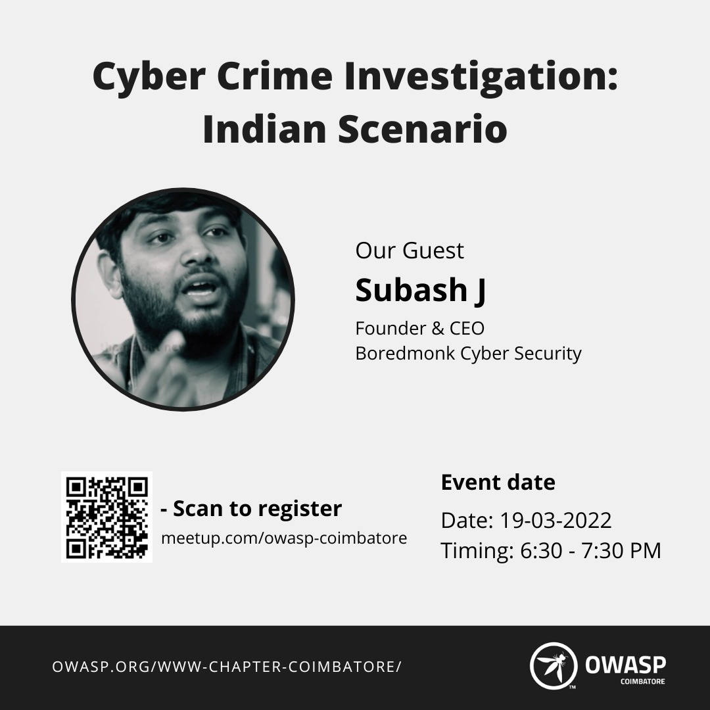
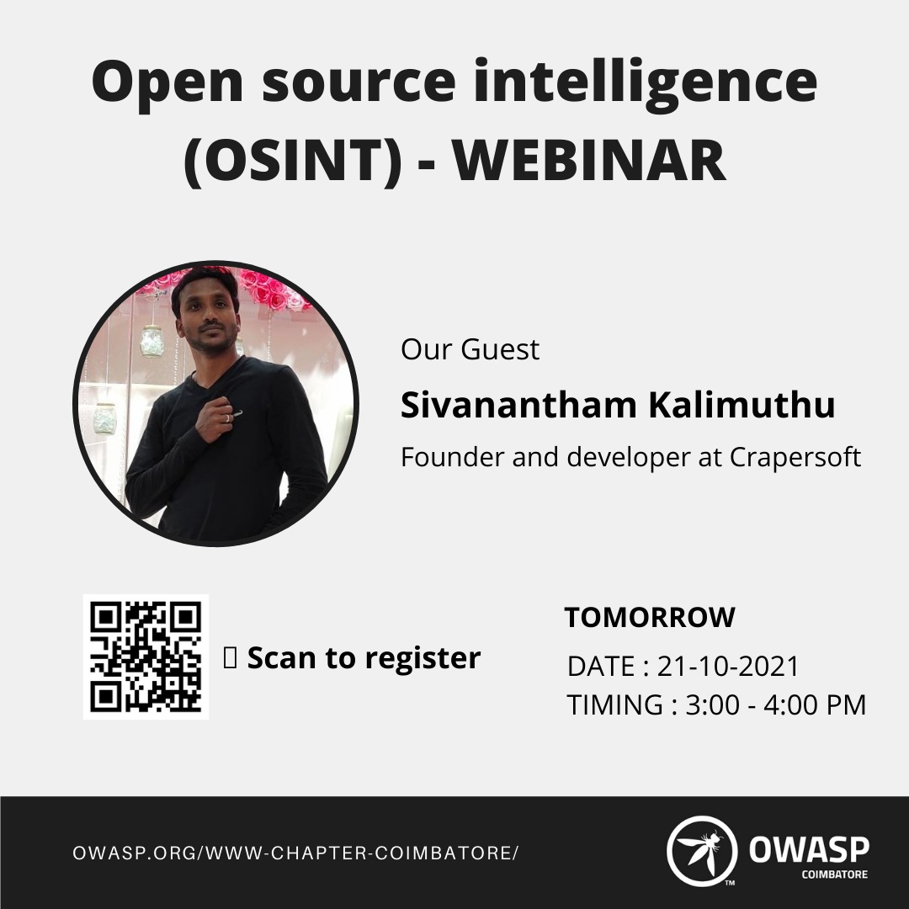
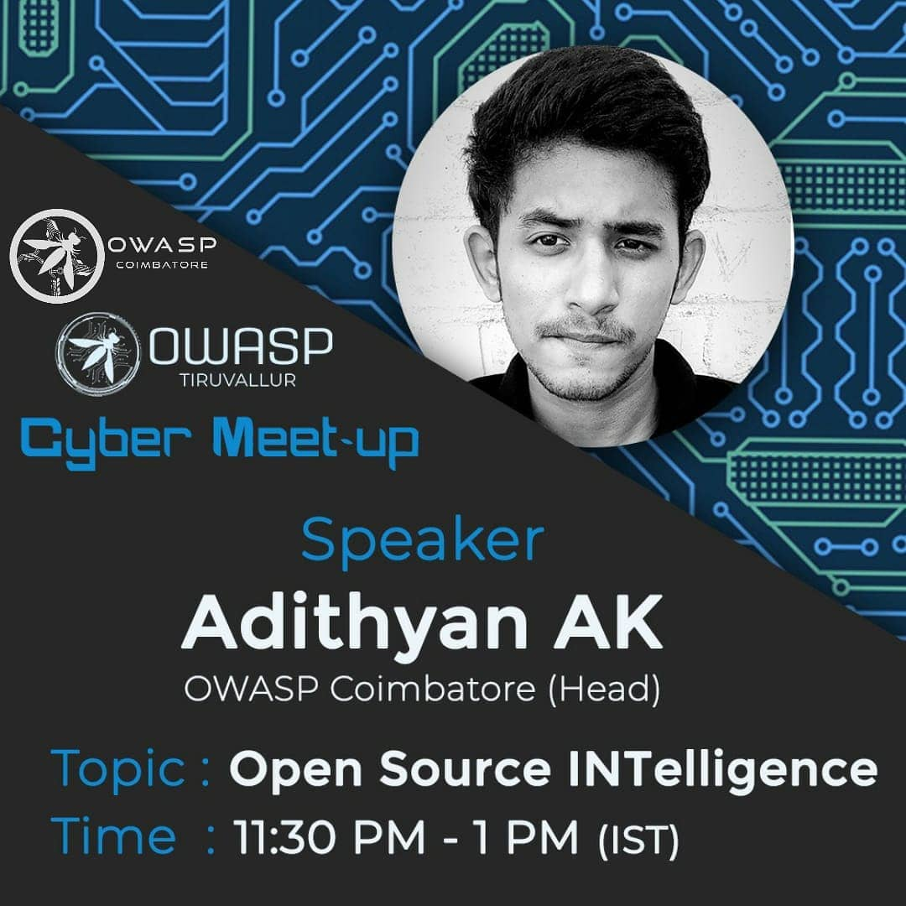
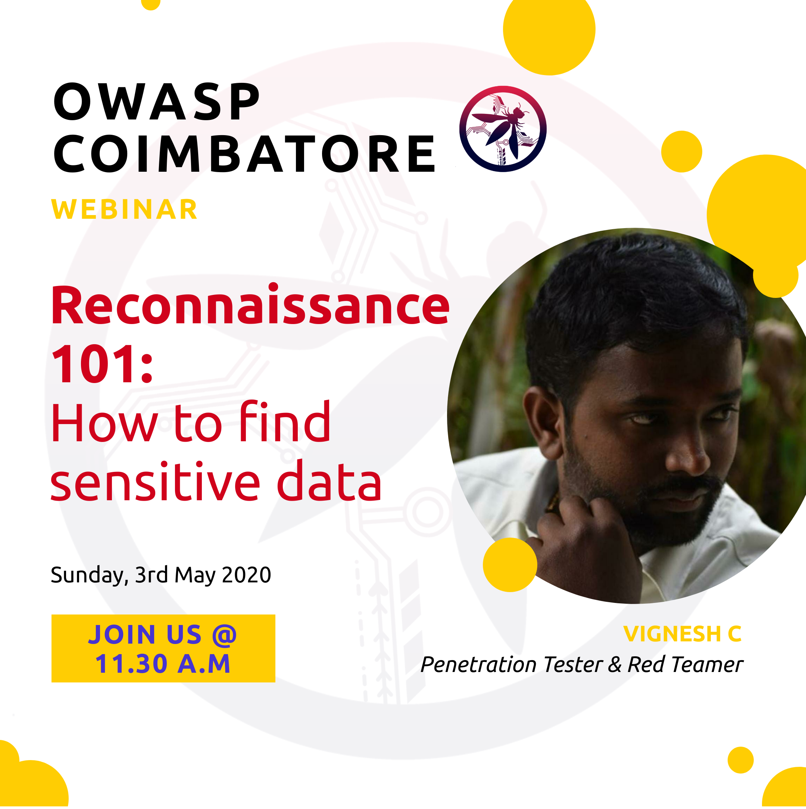

<h2>Past Events</h2>

  
6 July 2024, 05:45 PM - OWASP Coimbatore Combined Monthly Meetup

  

    <strong>OWASP Coimbatore Combined Monthly Meetup</strong>
     
    

      
      
      
    

     
    <strong>Date:</strong> Saturday, July 6, 2024
     
    <strong>Time:</strong> 5:45 PM – 10:00 PM (IST)
     
    <strong>Location:</strong> Online via Google Meet
     
     
    <strong>Agenda</strong>
    <ul>
      <li>5:45 PM - 6:00 PM: Introduction and Welcome</li>
      <li>6:00 PM - 7:00 PM: Ashok Kumar Mohan - <em>Unveiling Hidden Connections: Metadata Association Models in Cyber Crime Investigations</em></li>
      <li>7:00 PM - 7:45 PM: B.N. Chandrapal - <em>"Well, it's just an AWS Account ID"</em></li>
      <li>7:45 PM - 8:30 PM: Manivannan Arumugam - <em>"The Anatomy of Malware Campaign"</em></li>
      <li>8:30 PM - 8:40 PM: Conclusion</li>
    </ul>
  

  
30 December 2022, 07:30 PM - A webinar on Cyber Forensics

  

    <strong>A webinar on Cyber Forensics</strong>
     
    
  

  
9 April 2022, 06:30 PM - A webinar on Introduction to Bug Bounty

  

    <strong>A webinar on Introduction to Bug Bounty</strong>
     
    
  

  
19 March 2022, 06:30 PM - A webinar on Cyber Crime Investigation: Indian Scenario by Subash J.

  

    <strong>A webinar on Cyber Crime Investigation: Indian Scenario by Subash J.</strong>
     
    
  

  
21 October 2021, 3:00 PM - 4:20 PM - Hosted a webinar on Open Source Intelligence (OSINT)

  

    <strong>Hosted a webinar on Open Source Intelligence (OSINT)</strong>
     
    
  

  
27 September 2020, 11:30 AM - 1:00 PM - OWASP Tiruvallur in collaboration with OWASP Coimbatore conducted a free cyber meetup

  

    <strong>OWASP Tiruvallur in collaboration with OWASP Coimbatore conducted a free cyber meetup.</strong>
    Adithyan AK from OWASP Coimbatore delivered a session on Open Source Intelligence.
     
    
  

  
3rd May 2020, 11:30 AM - Let's Recon by Mr. Vignesh C

  

    <strong>Let's Recon by Mr. Vignesh C</strong>
     
    
     
    <strong>Platform</strong> Google Meets
     
    <strong>Slides</strong> <a href="https://github.com/OWASP/www-chapter-coimbatore/blob/master/assets/files/Lets%20Recon.pdf">Let's Recon by Mr. Vignesh C</a>
  

  
2nd February 2020, 6:00 PM - 8:00 PM - OWASP Coimbatore Python - Security Essentials Webinar

  

    <strong>OWASP Coimbatore Python - Security Essentials Webinar</strong>
     
    <strong>Platform</strong> Zoom
  

  
13th December 2019, 7:00 PM - 9:00 PM - OWASP Coimbatore Bug Bounty Webinar

  

    <strong>OWASP Coimbatore Bug Bounty Webinar</strong>
     
    <strong>Platform</strong> Google Hangouts Meet
  

  
29th September 2019, 7:30 PM - 8:30 PM - OWASP Coimbatore Ethical Hacking Hands-On Webinar in Tamil

  

    <strong>OWASP Coimbatore Ethical Hacking Hands-On Webinar in Tamil</strong>
     
    <strong>Platform</strong> GoTo Meeting
  

  
21st June 2019, 6:00 PM - 8:00 PM - OWASP Coimbatore Application Security Online Workshop

  

    <strong>OWASP Coimbatore Application Security Online Workshop</strong>
     
    <strong>Platform</strong> GoTo Meeting
  

  
16th April 2019, 2:30 PM - OWASP Coimbatore Monthly Chapter Meetup

  

    <strong>OWASP Coimbatore Monthly Chapter Meetup</strong>
     
    <strong>Venue</strong> Sri Krishna College of Engineering and Technology, Bkpudur, Coimbatore - 641008
  

  
12th March 2019, 6:00 PM - OWASP Coimbatore Monthly Chapter Meetup

  

    <strong>OWASP Coimbatore Monthly Chapter Meetup</strong>
     
    <strong>Venue</strong> Sri Krishna College of Engineering and Technology, Bkpudur, Coimbatore - 641008
  

  
3rd February 2019 - OWASP Coimbatore Monthly Chapter Meetup

  

    <strong>OWASP Coimbatore Monthly Chapter Meetup</strong>
     
    <strong>Agenda</strong>
    <ul>
      <li>09:30 AM – 10:00 AM => Meetup starts</li>
      <li>10:00 AM – 11:00 AM => How Do I Pwn You - Vignesh C, KGISL</li>
      <li>11:00 AM - 11:15 AM => Break</li>
      <li>11:15 AM – 11:45 AM => Breaking Fingerprint Authentication 2 - Mesanch M, StrongBox IT Pvt Ltd.</li>
      <li>11:45 AM – 12:30 PM => Cracking OSCP: Try Harder - Sanoj, StrongBox IT Pvt Ltd.</li>
      <li>12:30 PM – 12:45 PM => Meetup ends</li>
    </ul>
    <strong>Venue</strong> Sri Krishna College of Engineering and Technology, Bkpudur, Coimbatore - 641008
  

  
6th January 2019 - OWASP Coimbatore Monthly Chapter Meetup

  

    <strong>OWASP Coimbatore Monthly Chapter Meetup</strong>
     
    <strong>Agenda</strong>
    <ul>
      <li>09:30 AM – 10:00 AM => Meetup starts</li>
      <li>10:00 AM – 11:00 AM => Networking Fundamentals in Cyber Security - Vignesh C, KGISL</li>
      <li>11:00 AM - 11:15 AM => Break</li>
      <li>11:15 AM – 11:45 AM => OWASP Top 10 2018 Testing Guide - Adithyan AK, OWASP Coimbatore</li>
      <li>11:45 AM – 12:30 PM => Breaking Fingerprint Authentication 1 - Mesanch M, StrongBox IT Pvt Ltd.</li>
      <li>12:30 PM – 12:45 PM => Meetup ends</li>
    </ul>
    <strong>Venue</strong> Sri Krishna College of Engineering and Technology, Bkpudur, Coimbatore - 641008
  

  
11th November 2018 - OWASP Coimbatore Monthly Chapter Meetup

  

    <strong>OWASP Coimbatore Monthly Chapter Meetup</strong>
     
    <strong>Agenda</strong>
    <ul>
      <li>09:30 AM – 10:00 AM => Workshop Inauguration</li>
      <li>10:00 AM – 11:00 AM => Getting started with Bug Bounty - Guhan Raja, Priyadharshini Engineering college</li>
      <li>11:00 AM - 11:30 AM => Break</li>
      <li>11:30 AM – 12:30 PM => Buffer Overflows and Exploit Development- Mohan Ravinchandran</li>
      <li>12:30 PM – 12:45 PM => Ending ceremony</li>
    </ul>
    <strong>Venue</strong> Sri Krishna College of Engineering and Technology, Bkpudur, Coimbatore - 641008
  

  
9th September 2018 - OWASP Coimbatore Monthly Chapter Meetup

  

    <strong>OWASP Coimbatore Monthly Chapter Meetup</strong>
     
    <strong>Agenda</strong>
    <ul>
      <li>09:30 AM – 10:00 AM => Meetup starts</li>
      <li>10:00 AM – 11:00 AM => OWASP IOT Top 10 - Adithyan AK, OWASP Coimbatore</li>
      <li>11:00 AM - 11:15 AM => Break</li>
      <li>11:15 AM – 11:45 AM => Session Hijacking with Advanced Cross Site Scripting attacks - Guhan Raja</li>
      <li>11:45 AM – 12:30 PM => Why Networking is essential for Cyber Security Beginners - Vignesh C, KGISL</li>
      <li>12:30 PM – 12:45 PM => Meetup ends</li>
    </ul>
    <strong>Venue</strong> Sri Krishna College of Engineering and Technology, Bkpudur, Coimbatore - 641008
  

