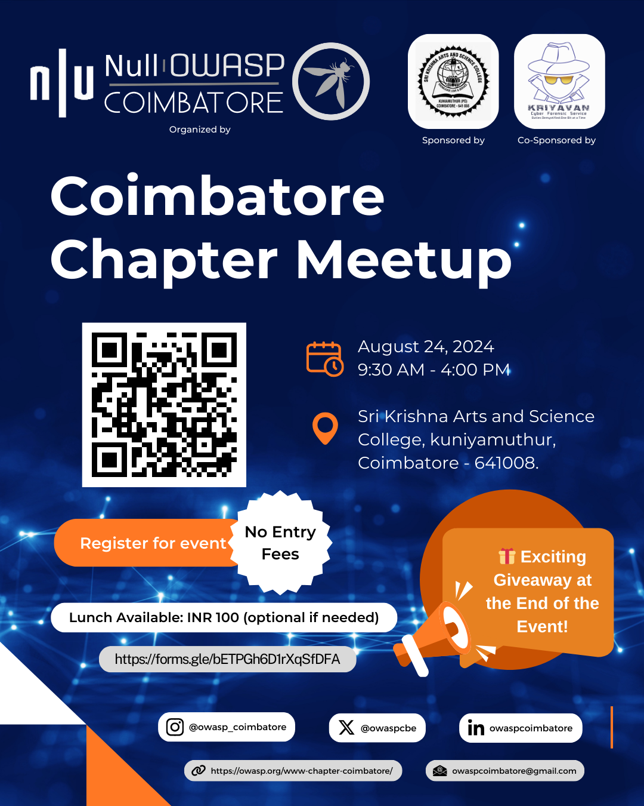

<h2>Upcoming Events</h2>

We are thrilled to announce our next big event!

<h3>OWASP & Null Combined Coimbatore Chapter Meetup</h3>

<strong>Date:</strong> August 24, 2024 
<strong>Time:</strong> 9:30 AM - 4:00 PM 
<strong>Venue:</strong> Sri Krishna College of Arts and Science, Kuniyamuthur, Coimbatore - 641008.

**Our Guest Speakers**

- **Jeet Raj Kumar**  
  *Senior DevSecOps Specialist*  
  Topic: Challenges in Enterprise DevSecOps & Increasing Security Testing Efficiency

- **Subash Jaganathan**  
  *Cyber Security Consultant*  
  Topic: Digital Forensics & Incident Response Operations

- **Vignesh Chandrasekaran**  
  *Senior Cyber Security Consultant*  
  Topic: Purple Team Tabletop Exercise

- **Avinash R**  
  *Senior Cyber Security Consultant*  
  Topic: Web Application Pentesting

- **Harish R**  
  *Security Researcher*  
  Topic: Next-Gen Wi-Fi Security Trends

- **Aaditya Rengarajan**  
  *Ex-ISRO Intern & Security Researcher*  
  Topic: Aviation Security

Join us for a day filled with insightful sessions on cybersecurity, technology, and related topics. This is a fantastic opportunity to connect with industry experts and enthusiasts.

    

 

    

 

🎁 <strong>Exciting Giveaway</strong> Don't miss out on our exciting giveaway at the end of the event!

Stay tuned for more updates and details about our upcoming events!

