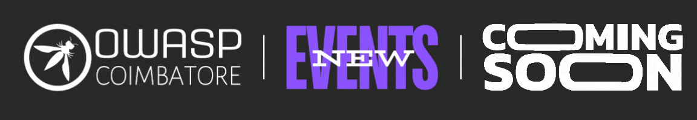

<h2>Upcoming Events</h2>

<h3>Monthly Meetup - Understanding Cloud Security with GOAT Tools</h3>

🗓 **Date:** Saturday, September 14, 2024  
🕕 **Time:** 6:00 PM - 7:00 PM  
📍 **Venue:** Online | Google Meet

<h3>Our Speaker</h3>

Vasanthabalaji

*Cloud and Security Researcher*

 

    

 

    

 

Stay tuned for more updates and details about our upcoming events!

